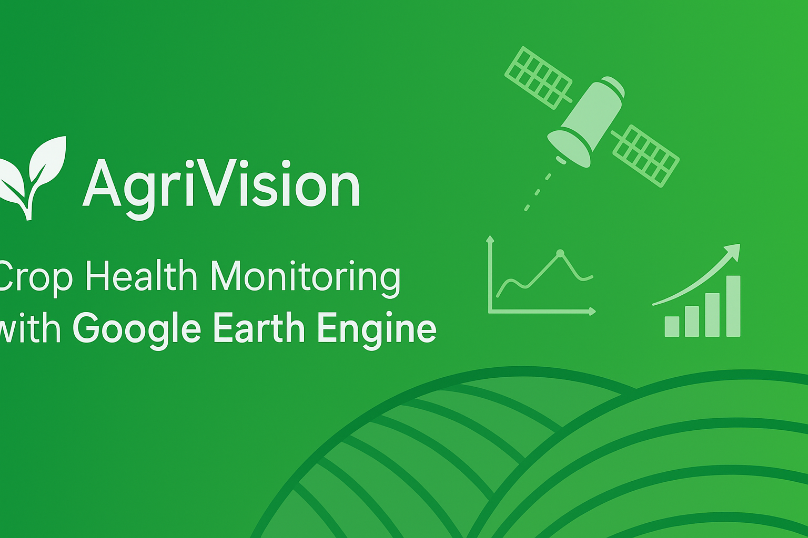

# 🌱 AgriVision – Crop Health Monitoring (GEE)

---

## 📌 About the Project
**AgriVision** is a satellite-based crop health monitoring tool using **Google Earth Engine (GEE)**.  
It provides real-time insights for farmers, agri-businesses, and co-operatives to make data-driven decisions.

---

## ✨ Key Features
- 🛰 **NDVI Analysis** – Detect crop stress and vegetation health.  
- 🌦 **Weather & Water Stress** – Monitor soil moisture and rainfall impact.  
- 📊 **Yield Prediction** – Estimate productivity using AI-driven models.  
- 🗺 **Interactive Maps** – High-resolution visualizations for better decision-making.  
- 📑 **Automated Reports** – Generate PDF-based insights for farmers & clients.  

---

## 📷 Sample Results

### Satellite-based NDVI Map

### Yield Prediction Insights

---

## 🚀 Workflow
1. Data Collection – Satellite (Sentinel, Landsat)  
2. Processing – Google Earth Engine scripts  
3. Analysis – NDVI, NDWI, and stress detection  
4. Reporting – Interactive maps + PDF reports  

---

## 📂 Repository Structure

---

## 📞 Contact
👨‍💻 **Bhojesh Nimje**  
📧 Email: [nimjebhojesh@gmail.com](mailto:nimjebhojesh@gmail.com)  
📱 Phone: +91 7887489072  

---

⭐ If you like this project, please **star the repository** to support!  
